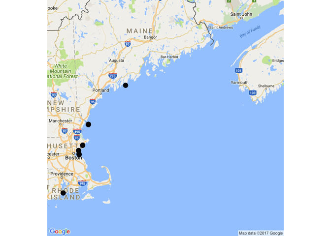
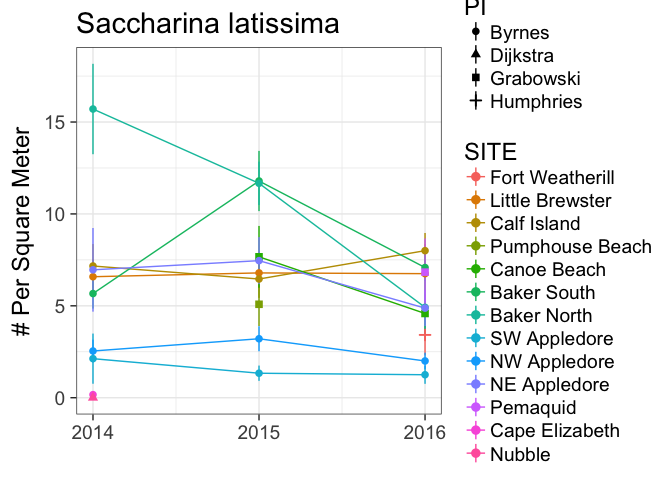
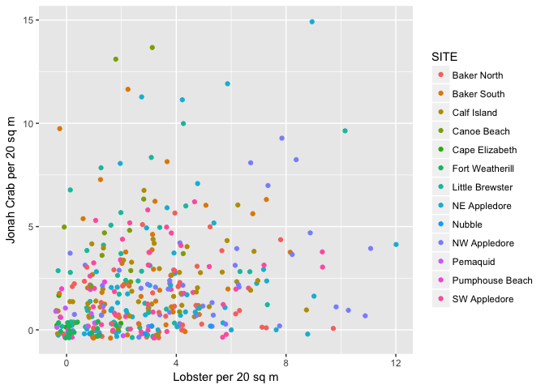

KEEN Raw Data and code to Clean and Merge
================

### Cleaning and Merging the KEEN Data

This repo contains the raw data from KEEN member nodes, the scripts used to clean and merge them, and the ultimate clean data to be depositived in Temperate ReefBase.

To clean and merge data, run the numbered scripts in the R folder in order. Note, the first script will use the species lists provided by regional coordinators to generate a master list for each region by querying WoRMS for current taxonomy.

The data QC script will also generate output error logs to diagnose any problems with the data at hand, beyond things that cause scripts to fail.

Using the Cleaned Data
----------------------

The `cleaned_data` folder contains the end-products of the data merging pipeline split into serveral files. Currently we have

keen\_sites.csv - The spatial information for all transects sampled
keen\_cover.csv - Results from Uniform Point Counts standardized to % cover
keen\_fish.csv - Fish abundances in different size classes
keen\_quads.csv - Counts of individual algae, inverts, and small fish in 1x1m quadrats
keen\_swath.csv - Counts of more rare algae, inverts, and small fish in 20x1m areas.

The data all have common keys of `SITE`, `TRANSECT`, and `YEAR` to be easily merged. Let's see this in action.

Making a Map of KEEN ONE sites.
-------------------------------

To examine KEEN ONE sites, let's use `ggmap` to plot them.

First we'll load a few needed libraries

``` r
library(tidyverse) #for dplyr and tidyr
library(forcats) #for factor manipulation
library(ggmap) #loads ggplot2 as well
```

Then load the data

``` r
sites <- read.csv("./cleaned_data/keen_sites.csv",
          stringsAsFactors=FALSE) 
```

Next, we want to get a single lat/long value for each site, so let's use their means over time.

``` r
sites_summary <- sites %>%
  group_by(SITE) %>%
  summarize(START_LATITUDE = mean(START_LATITUDE, na.rm=T),
            START_LONGITUDE = mean(START_LONGITUDE, na.rm=T)) %>%
  ungroup() %>% 
  arrange(START_LATITUDE)
```

I've arranged by start latitude for some purposes in future plots. Now, let's plot them!

``` r
keen_one_map <- get_map("Gulf of Maine",
                  zoom=7,
                  maptype="roadmap")

ggmap(keen_one_map) +
  geom_point(data=sites_summary, 
             mapping=aes(x=START_LONGITUDE,
                         y = START_LATITUDE),
             size=3) +
  theme_nothing() 
```



Quadat counts of kelp
---------------------

One of the first things you might want to do when plotting data is to join it with site information to, say, order things from south to north. Here, we'll do that with a `left_join` from `dplyr` and then use `fct_reorder` from `forcats` to arrange sites in the proper order

``` r
quads <-read.csv("./cleaned_data/keen_quads.csv",
                 stringsAsFactors=FALSE) %>% 
  select(-DAY, -MONTH) %>%
  left_join(sites_summary) %>%
  mutate(SITE = factor(SITE)) %>%
  mutate(SITE = fct_reorder(SITE, START_LATITUDE))
```

With the data prepped, we'll plot the trjectories both looking at trendlines, and the mean and SE for each site in each year.

``` r
kelp_summary_quad <- quads %>%
         filter(SP_CODE == "SL") %>%
         group_by(SITE, YEAR, PI) %>%
         summarise(COUNT = mean(COUNT, na.rm=T))

ggplot(kelp_summary_quad,
       aes(x=YEAR, y=COUNT, color=SITE, shape=PI)) +
  geom_line() +
  stat_summary(data=quads %>%
                 filter(SP_CODE == "SL")) +
  theme_bw(base_size=18) +
  scale_x_continuous(breaks=c(2014, 2015, 2016)) +
  labs(title="Saccharina latissima") +
  ylab("# Per Square Meter") + xlab("")
```



Biplots of Different Species with Swaths
----------------------------------------

The data here is in a long format. Many species are missing from each sample, as they were not present. If we want to make biplots of one species against another, we will both have to reshape the data to a wide format as well as fill in all of those zeroes. Fortunately, this is straightforwad with tools like the `tidyr` library.

Let's load the swath data...

``` r
swath <-read.csv("./cleaned_data/keen_swath.csv",
                 stringsAsFactors=FALSE) 
```

and now we can reshape it

``` r
swath_wide <- swath %>%
  select(-(GROUP:NOTES)) %>%
  spread(SP_CODE, COUNT, fill=0)
```

and finally plot it, using a jitter plot to deal with overlapping values

``` r
ggplot(swath_wide, 
       aes(x=HOAM, y=CABO, color=SITE)) +
  geom_jitter() +
  xlab("Lobster per 20 sq m") +
  ylab("Jonah Crab per 20 sq m")
```



More?
-----

If you have other types of analyses you'd like to see here, please, file an issue report and I'll add it!
